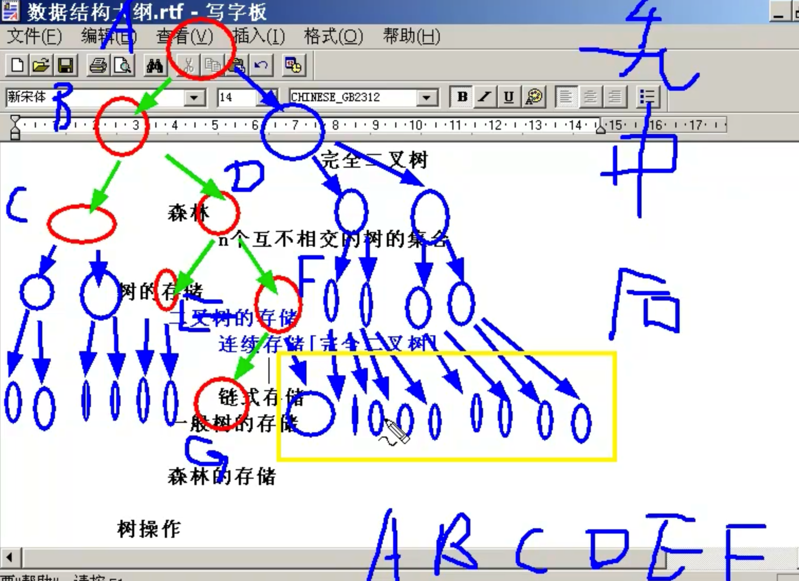
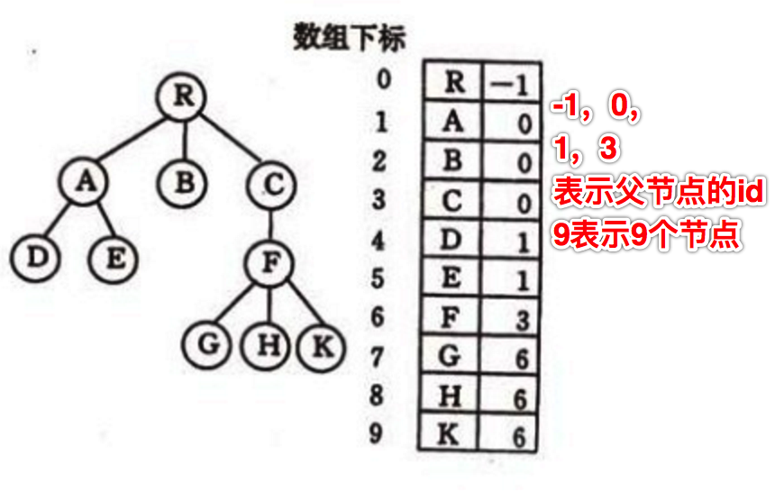

###树定义

###专业定义：

1.有且只有一个称为根的节点

2.有若干个互不相交的子树，这些子树本身也是一颗树

通俗的定义：

1.树是由节点和边组成。

2.每个节点只有一个父节点但可以有多个子节点

3.但有一个节点例外，该节点没有父节点，此节点称为根节点

###树分类

一般树
	
任意一个节点的子节点的个数都不受限制

二叉树
	
任意一个节点的子节点个数最多两个，且子节点的位置不可更改

分类：

1. 一般二叉树
2. 满二叉树（在不增加层数的前提下，无法再多添加一个节点的二叉树就是满二叉树）
3. 完全二叉树（如果只是删除了满二叉树最底层，最右边连续若干个节点，这样形成的二叉树就是完全二叉树）

完全二叉树包含了满二叉树（是完全二叉树的特例，一个不删就是满二叉树）。

森林

n个互不相交的树的集合。

###树的存储

1.二叉树的存储

* 连续存储【完全二叉树】（如果要以数组的方式来存储，需要把一般的二叉树转换成完全二叉树存储）
	* 优点： 查找某个节点的父节点和子节点（也包括判断有没有）
	* 缺点：好用内存空间过大
不是线性结构，线性结构顺序是确定的，先保存哪个后保存哪个是死的，二叉树不一样，二叉树不是线性结构，如果以线性结构保存，哪个在前哪个在后，本身这是个问题。数组是线性结构，树是非线性结构，要把非线性结构当成线性结构存储，必须告诉我的规定是啥，要不然不知道哪个在前哪个在后。

把非线性转换成线性方法：

* 先序遍历

* 中序遍历

* 后序遍历

存储的时候不能存有效节点，根据内存的顺序无法推断出以前的树是什么样子（以什么方式构造出来的）。这就是为啥要把树转换成完全二叉树。如果是数组，必须以完全二叉树来存储。完全二叉树可以知道层数是几层。给任何树的编号，能判断有没有子节点，父节点。

* 链式存储

一个元素：数据域，左孩子指针域，右孩子指针域。（当然如果为了找父节点，可以加一个指向父节点的指针域。）

内存浪费空指针域。n个节点只浪费n+1，属于线性浪费。

不需要层次的去存，通过指针域弄成有层次的树。

2.一般树的存储

* 双亲表示法：求父节点方便

* 孩子表示法：求子节点方便
* 双亲孩子表示法
* 二叉树表示法

3.森林的存储

参考资料：

* 《2.孩子链表表示法》<http://student.zjzk.cn/course_ware/data_structure/web/shu/shu6.5.2.2.htm>

