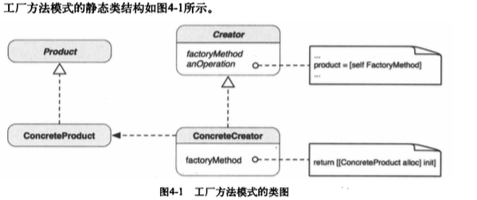

#你好设计模式


###1.5设计模式的起源----模型、视图和控制器（MVC）


MVC设计模式机器变体至少在Smalltalk诞生初期就已经出现了。这个设计模式是Cocoa Touch中很多机制和基础。

#####1.5.1模型再对象中封装数据和基本行为

#####1.5.2视图对象向用户展示信息

#####1.5.3控制器对象联系模型和视图

#####1.5.4复合设计模式的MVC

MVC本身并不是最基本的设计模式，包含了若干更加基本的模式。基本设计模式相互配合，确定了各功能之间的协作。

Cocoa（Touch）的MVC 用到的模式有：组合（Composite）、命令（Command）、中介者（Mediator）、策略（Strategy）和观察者（Observer）。

* 组合——视图对象之间以写作的方式构成一个视图层次体系，其中既可以有复合视图（比如表格视图），也可以有独立视图（比如文本框或按钮）。每个层次的每个视图节点都可以响应用户的操作并把自己绘制到屏幕上。
* 命令——这是一种“目标——动作”机制，视图对象可以推迟其他对象（比如控制器）的执行，让其他对象等到发生了某些事件后再执行。这一机制构成了命令模式。
* 中介者——控制器对象起着中间人的作用，这个中间人采用了中介模式，它构成了模型和视图对象之间传递数据的双向通道。应用程序的控制器对象将模型变更传达给视图对象。
* 策略——控制器可以是视图对象的一个“策略”。视图对象将自身隔离，以期维持其作为数据展示器的唯一职责，将一切应用程序持有的界面行为决定委派给它的“策略”对象（既控制器）
* 观察者——模型对象向它所关注的控制器等对象发出内部状态变化的通知。

###1.6 影响设计的几个问题

#####1，6.1 针对接口编程，而不是针对实现编程

定义具有相同接口的类群很重要，因为多态是基于接口的。

实现协议或者从抽象类继承，使得对象共享相同的接口。

好处：

* 只要对象对象符合客户端所要求的接口，客户端就不必在意所使用对象的确切类型；
* 客户端只知道定义接口的协议或者抽象类，因此客户端对对象的类一无所知。

客户端代码中不声明特定具体类的变量，而只使用协议或抽象类定义的接口。这种理念和思想贯穿本书。

#####1.6.2 @protocol 与 抽象基类

比如说有个协议叫Mark

```
id<Mark> thisMark;
```

如果Mark被声明为抽象基类，那么语法应该跟其他类一样

```
Mark *thisMark;
```

在接受以Mark协议的对象作为参数的方法中，语法应该是这样：

```
- (void)anOperaionWithMark:(id <Mark>) aMark;
```

如果Mark是抽象基类，那么语法是这样：

```
- (void)anOperaionWithMark:(Mark *)aMark;
```

Mark协议引用有些笨拙。但是为什么还要使用协议？

OC 不支持多重继承。如果一个类既要是UIView的子类，又钥匙定制的抽象类型，那么这个抽象类型就只能是协议而不能是抽象基类。


##### 1.6.3 对象组合与类继承

子类化常常被称为`白箱复用`（white-box reuse），因为父类的内部描述与细节通常对子类可见。

对象组合可以替代类继承。对象组合要求被组合的对象具有定义良好的接口，并且通过从其他对象得到的引用在运行时动态定义。所以可以将对象组合到其他对象中，以构建更加复杂的功能。由于对象内部细节对其他对象不可见，它们上去为“黑箱”，这种类型的复用称为`黑箱复用`（black-box-reuse）。


类继承的优点：

* 简单直接，关系在编译时静态定义
* 被复用的实现易于修改

缺点：

* 类继承在编译时定义，所以无法在运行时变更从父类继承来的实现
* 子类的部分描述常常定义在父类中
* 子类直接面对父类实现的细节，因此破坏了封装
* 父类实现的任何变更都会强制子类也进行变更，因为他们的实现联系在了一起
* 在新的问题场景下继承来的实现已过时或不适用，所以必须重写父类或继承来的实现

由于实现的依存关系，对子类进行复用可能会有问题。有一个解决办法是，只从协议或抽象基类继承（子类化），因为它们只有很少的实现，协议则没有实现


`优先使用对象组合而不是类继承`


### 1.7


##第二章 案例分析：设计一个应用程序

设计过程有3个重要的里程碑：

* 想法的概念化
* 界面外观的设计
* 架构设计

#### 2.3.1 视图管理

控制器在视图与模型之间起协调作用。因此每个控制器“拥有”一个视图和一个模型。


最初UI设计，有3个控制器

* CanvasViewController 主画布，用户用手指在该视图中涂鸦
* PaletteViewController 管理一组用户控件元素。
* ThumbnailViewController

CanvasViewController 包含主画布视图，用户在该视图中涂鸦。PaletteViewController管理一组用户控件元素，让用户可以调节线色与线宽。新的设定会传递给CanvasViewController的模型。ThumbnailViewController以缩略图的形式展示先前保存的全部涂鸦图，用户可以浏览并单击打开涂鸦图。有关涂鸦的全部必须信息会传递给CanvasViewController，以将涂鸦图显示在画布视图。

1.从一个视图到另一个视图的迁移

当用户单击CanvasViewController的调色面板按钮时，视图会替换PaletteViewController的视图。同样单击CanvasViewController的打开缩略视图的按钮，会打开ThumbnailViewController的视图。当用户点击导航条上的Done按钮以结束当前操作时。

2.使用中介者来协调视图迁移

#### 2.3.2如何表现涂鸦

2.用组合结构来表示痕迹

可以使用所知的任何数据结构来存储线条和点等。但是，如果全部都用（比如说）多维数组来保存，使用和解析时，就需要很多类型检查，而且要使结构可靠而一致，需要大量的调试工作。如果使用一种结构既可以保存独立的点，又可以保存把点（顶点）作为子节点的线条，面向对象的方法是使用树。树的表现形式，能够把线条与点这样的复杂对象管理组织与局限于一处。解决这种结构问题的一种设计模式叫做组合模式。


##工厂方法

工厂方法模式是抽象工厂模式的组成部分。各种具体工厂重载其抽象工厂类中定义的工厂方法，并用这个重载的工厂方法创建自己的产品（对象）。

对象工厂与生产有形产品的真实工厂类似，例如，制鞋厂生产鞋，手机厂生产手机。比方说，你让工厂给你生产些产品，你给它们发送一个“生产产品”的消息。制鞋厂和手机工厂都按照相同的“生产产品”的协议，启动其生产线。过程结束后，每个厂家都返回所生产特定类型的产品。把“生产”这个词称做工厂方法，因为它是命令生产者（工厂）得到想要的产品的方法。

生产者不必是抽象工厂，它可以是任何类。要点在于不是直接创建对象，而是使用类或对象的工厂方法创建具体产品，并以抽象类型返回。

### 4.1 何为工厂方法模式

工厂方法也称为虚构造器（virtual constructor）。适用于这种情况：一个类无法预期需要生产哪个类的对象，想让其子类来指定所生产的对象。



抽象的Product（产品）定义了工厂方法创建的对象的接口。ConcreteProduct实现了Product接口。Creator定义了返回Product对象的工厂方法。它也可以为工厂方法定义一个默认实现，返回默认ConcreteProduct对象。creator的其他操作可以调用此工厂方法创建Product对象。ConcreateCreator是Creator的子类。它重载了工厂方法，以返回ConcreteProduct的实例。

> 工厂方法模式：定义创建的接口，让子类决定实例化哪一个类，工厂方法使得一个类的实例化延迟到子类。

工厂方法的最初定义好像专注于让子类决定创建什么对象。有一种变体，抽象类使用工厂方法创建其私有子类或任何其他类的对象。

### 4.2 何时使用工厂方法

* 编译时无法准确预期要创建的对象的类；
* 类想让其子类决定在运行时创建什么；
* 类有若干辅助类为其子类，而你想返回哪个子类这一信息局部化。

使用这一模式的最低限度是，工厂方法能给予类在变更返回哪一种对象这一点更多的灵活性。使用这一架构的一个常见例子是Cocoa Touch框架（或一般的Cocoa）中的NSNumber。尽管可以使用常见的alloc init两步法创建NSNumber实例，但这没什么用，除非使用预先定义的类工厂方法来创建有意义的实例。例如：[NSNumber numberWithBool: YES]消息会得到NSNmber的子类NSCFBoolean的一个实例，这个实例包含传给工厂方法的布尔值。工厂方法模式对框架设计者特别有用。

### 4.3 为何这是创建对象的安全方法

与直接创建新的具体对象相比，使用工厂方法创建对象可算作一种最佳做法。工厂方法模式让客户程序可以要求由工厂方法创建的对象拥有一组共同的行为。所以往类层次结构中引入新的具体产品并不需要修改客户端代码，因为返回的任何具体对象的接口都跟客户端一直在用的从前的接口相同。

### 4.4 在Cocoa Touch 框架中应用工厂方法

工厂方法在Cocoa Touch框架中几乎随处可见。例如：NSNumber有很多numberWith*方法，其中有两个是numberWithBool:和numberWithChar:。它们是类方法，也就是说我们向NSNumber发送[[NSNumber numberWithBool: bool]]与[[NSNumber numberWithBool:bool]]的情况是，方法接受值bool，并把NSNumber的内部子类的一个实例化，让它能够反映策划人怒的值bool。


