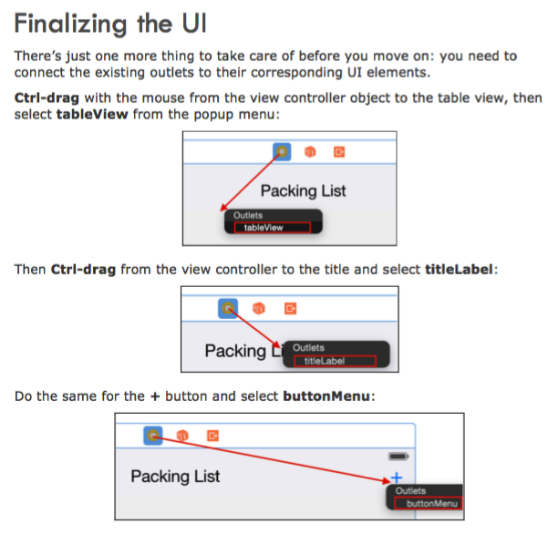
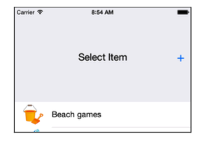

##第二部分 Auto Layout

 
自动布局背后的核心思想是非常简单的：它可以让你定义你的应用程序的用户界面元素的布局，你创建的每个元素的布局之间的关系。既控件与控件的关系（父子或兄弟，等宽等高，比例等等的附属关系以及几何关系）

###第六章 介绍自动布局

我想，不用翻译了。直接略过。


 
###第七章 动画约束

您的首要任务是在用户点击“+”按钮时扩展菜单。为了做到这一点，你需要通过使其高度约束改变菜单栏的高度。



```
UIView.animateWithDuration(1.0, delay: 0.0, usingSpringWithDamping: 0.4, initialSpringVelocity: 10.0, options: .CurveEaseIn, animations: {
self.view.layoutIfNeeded() }, completion: nil)
```

参考资料：

《iOS_Animations_by_Tutorials》


