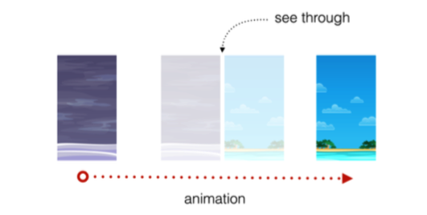
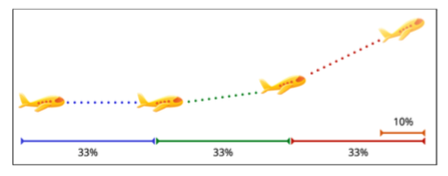
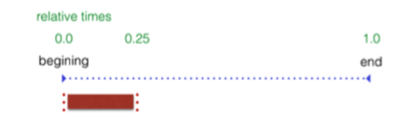
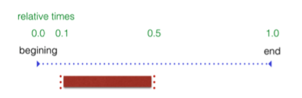

```
class func animateWithDuration(duration: NSTimeInterval, animations: () -> Void) 
```
这个方法是立刻执行

```
class func animateKeyframesWithDuration(duration: NSTimeInterval, delay: NSTimeInterval, options: UIViewKeyframeAnimationOptions, animations: () -> Void, completion: ((Bool) -> Void)?)
```

动画的参数是

* duration：动画持续时长
* delay：等待执行时长
* options：执行动画选项掩码
* animations：动画执行闭包
* completion：动画完成后执行的闭包

###动画属性

####Position和Size

* bounds
* frame
* center

####外貌

* backgroundColor
* alpha

####形变

* transform


###动画选项

`UIViewAnimationOptions`枚举选项你可以用不同的方式组合在你的动画中

#### Repeating
* .Repeat：无限循环执行
* .Autoreverse：倒着执行（正着执行后，反着执行）通常配合.Repeat使用

####Animation easing

在现实生活中的事情不只是突然开始或停止移动。汽车或火车的物理对象，直到他们达到目标的速度，慢慢加速，除非他们打一个砖墙，他们慢慢地放慢，直到他们来到一个完整的站在他们的最后目的地。

* .Linear：线性，此选项适用于动画没有加速或减速。也就是匀速呗
* .CurveEaseIn: 动画开始加速
* .CurveEaseOut: 动画结束时减速
* .CurveEaseInOut: 动画开始加速，动画结束时减速

 
为了更好地理解这些选项如何为您的动画添加视觉冲击，您将在项目中尝试一些选项。


###第四章 动画练习

效果：



代码如下：

```
func fadeImageView(imageView: UIImageView, toImage: UIImage, showEffects: Bool) {
    UIView.transitionWithView(imageView, duration: 1.0, options: [.TransitionCrossDissolve], animations: { () -> Void in
            imageView.image = toImage
        }, completion: nil)
    UIView.animateWithDuration(1.0, delay: 0.0, options: [.CurveEaseOut], animations: { () -> Void in
        self.snowView.alpha = showEffects ? 1.0 : 0.0
        }, completion: nil)
}

```
上面的的方法，需要传入三个参数

1.imageView：褪去的imageView

2.toImage：想要显示的新的图片

3.showEffects:是否隐藏雪花效果

###第五章 关键帧动画

考虑的另一个动画，描绘了一个飞机的起飞顺序。这部动画的不同阶段会像下面这样



打开ViewController.swift;

代码如下：

```
UIView.animateKeyframesWithDuration(1.5, delay: 0.0, options: [], animations: { () -> Void in
UIView.addKeyframeWithRelativeStartTime(0.0, relativeDuration: 0.25, animations: {
    self.planeImage.center.x += 80.0
    self.planeImage.center.y -= 10.0
    })
}, completion: nil)

```

关键帧的开始时间，以及它的持续时间是相对于动画的整个持续时间。相对值是你指定一个关键帧执行的所占总时间的一部分。UIKit需要每个关键帧的相对执行时间并且计算出每个关键帧动画的确切时间，节省您大量的工作。

在上面的代码的最后一点设置的开始时间为0，立即的时间和持续时间为0.25，占25%的总动画时间：



当然，这是创造完整动画序列的第一步。创建第二个关键帧，添加到第一个`addKeyframeWithRelativeStartTime`之后：

```
UIView.addKeyframeWithRelativeStartTime(0.1, relativeDuration: 0.4, animations: { () -> Void in
    self.planeImage.transform = CGAffineTransformMakeRotation(CGFloat(-M_PI_4/2))
    })
```

第二个关键帧开始10%的方式进入动画和持续的总时间的40%。这个关键帧的旋转飞机在离跑道：



添加第三个关键帧动画：

在这个动画步骤中，让飞机继续移动接着淡出。
```
UIView.addKeyframeWithRelativeStartTime(0.25, relativeDuration: 0.25) { self.planeImage.center.x += 100.0
	self.planeImage.center.y -= 50.0
	self.planeImage.alpha = 0.0
}
```

飞机就这么消失了。现在需要让它返航，准备下一次原地起飞。

那么，下一次起飞之前，你必须重置它的航向。也就是撤销旋转，将它移到可见区域的左边。

因为是不可见的，所以，你可以移动它，反正用户看不到，代码如下：

```
UIView.addKeyframeWithRelativeStartTime(0.51, relativeDuration: 0.1, animations: { () -> Void in
	self.planeImage.transform = CGAffineTransformIdentity
	self.planeImage.center = CGPoint(x: 0.0, y: originalCenter.y)
})
```

现在让它显示出来，并回归原位：


```
UIView.addKeyframeWithRelativeStartTime(0.55, relativeDuration: 0.45, animations: { () -> Void in
    self.planeImage.alpha = 1.0
    self.planeImage.center = originalCenter
})
```

关键帧是一个非常有用的和灵活的方式来设计和控制你的动画。

####关键帧中的计算模式

关键帧动画不支持内置的缓和曲线，在标准的UIView动画是可用的。设计如此：关键帧的开始和结束都要在特定的时间和流量的相互转化。

如果你的动画上面的每一个阶段都有一个缓和曲线，那架飞机就可以从一个动画到下一个动画，而不是平稳地移动到下一个。如果你可以应用于整个动画，这会导致你的动画持续时间被忽略了，这不是你想要的。

相反，你有几种计算模式可供选择；每种模式计算动画的中间帧，以及平滑的运动不同的优化甚至起搏提供了一个不同的方法。 更多的细节查看uiviewkeyframeanimationoptions。

现在你知道如何组合任意数量的简单的动画，使用关键帧动画，您可以创建想到的几乎任何顺序。


参考资料：

《iOS_Animations_by_Tutorials》


