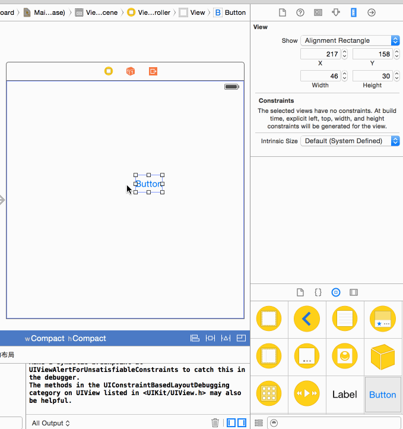

> 题记：本文根据《iOS AutoLayout 开发秘籍》整理，当然也会包括，我看到的其他资料整理。


##介绍


约束优先级是表示 Auto Layout 考虑各个布局请求的强烈程度的数字。Auto Layout使用优先级解决约束冲突，并决定优先级处理哪条规则。

约束优先级是可读的（有时是可设置的）属性。优先级范围从1（最低优先级）到1000（必需的优先级）。优先级是浮点数。

```
	typedef float UILayoutPriority;
	typedef float NSLayoutPriority; //MAC OS
```


##1.1冲突的优先级

优先级 501 的约束肯定比 优先级500的约束优先处理。假设，你要求一个视图的同时既是30点又是40点高，但是后者有较高的优先级，那么以40点高为标准。

下图是IB中的示例，我给button设置了两个宽的约束 一个是`45`，另一个是`100`。那么我们发现有红色的冲突。代表width的冲突。接着我调整了宽的约束的优先级。`100`的优先级是1000,`45`的优先级被我从1000调成了999。红色冲突消失。




那么出了IB中直接的拖控件操作，你也可以通过代码编写。使用NSLayoutConstraint编写。里面有个权限的属性`@property UILayoutPriority priority;`。本文只用IB演示。


##1.2枚举型优先级

----

UIKit中的UIView优先级

----
```
enum {
   UILayoutPriorityRequired  = 1000,
   UILayoutPriorityDefaultHigh  = 750,
   UILayoutPriorityDefaultLow  = 250,
   UILayoutPriorityFittingSizeLevel  = 50,
};
typedef float UILayoutPriority;

```

苹果建议灵活使用优先级，不要使用固定的优先级水平。在使用视图布局系统时，应该将优先级调整的略高或者略低，表示优先级与固定系统值相比的相对次序。

不是说不能将按钮的压缩阻力优先级设置为默认值 750，而是指当创建涉及该按钮的约束时，如果将优先级设置为 751，意思是“比默认压缩阻力更重要”：如果优先级设置为749，则表示“不如默认压缩阻力重要”。

注意：

在运行时更新约束优先级要非常小心，尤其是当优先级的值从必需值变成非必需值时；反之亦然。当一个更新的优先级的角色改变一个安装的约束的效果时，它可能会在运行时抛出异常。

###1.3 

 


------

###参考资料：


